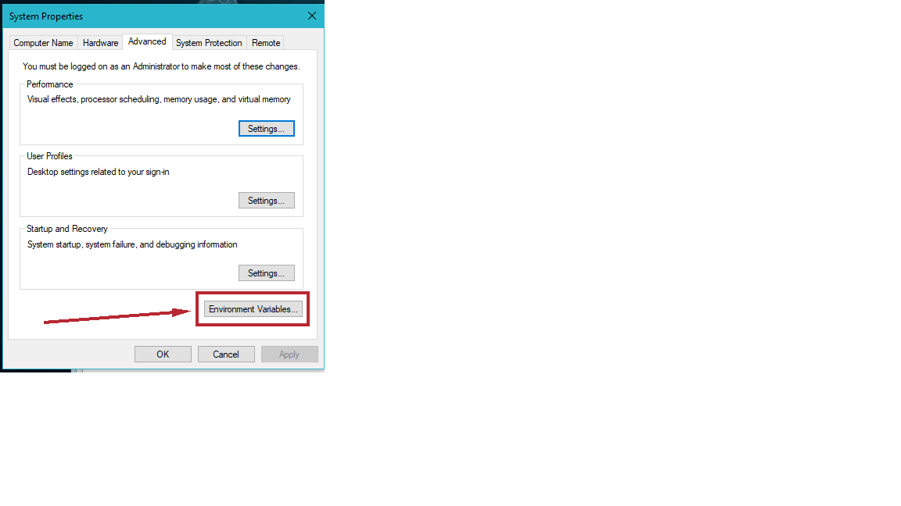
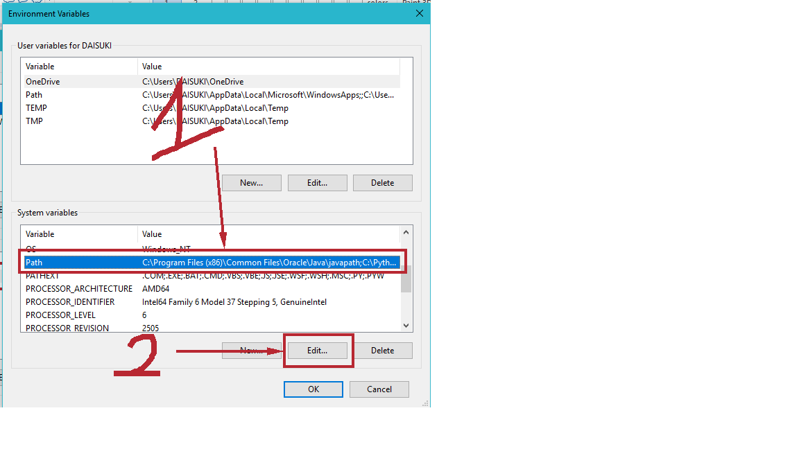

# simpleDB-on-windows
Installation simpleDB on windows
<h1>SimpleDB on Windows</h1>


<h1>Dowload SimpleDB</h1>
<h3> <a href="simple_db_2.zip">Link official *recommended</a> or <a href="SimpleDB_2.10.zip">Link backup path *not recommended</a></h3>
## Structure
1. simpledb - The server side code for the database.
2. studentclient - Example client-side code for the database
3. javadoc - API for the database

## Windows vs Mac vs Linux
Most instructions are the same between all three platforms, except for a few commands.
* `Start` is not a command in mac and Linux, so append the command with an `&` instead
    * `Start command` vs `command &`

* Variables in Macs and Linuxes are used differently than they are in Windows
    * To print the `PATH` variable in Windows: `echo %PATH%`
    * To print it on Mac or Linux: `echo $PATH`
    * Variables on both platforms must always be in ALL CAPS for them to be recognized

* Directories in Path variables are separted by `:` in Mac/Linux and `;` in Windows
* The home directory path is different for mac/linux and windows. If your username is **username** , then on mac/linux, the location would be: `/Users/username/` and on windows it would be `C:\Users\username`. I will use __username__ as the user name for the rest of the document, so replace it with what your actual username is.
## Installation on Windows 7+
<h2>Step 1 - Download and Installation</h2>
<h2>Installation Java SE</h2>
Remember well `download` and `Installation` Java `JDK` and `JRE`
<h2>`Download:` https://www.oracle.com/technetwork/java/javase/downloads/jdk8-downloads-2133151.html</h2>

<h2>Step 2 - Setup JAVA environment</h2>
<h2>You can see here *recommended: https://confluence.atlassian.com/doc/setting-the-java_home-variable-in-windows-8895.html</h2>
<h2>Setup all JDK and JRE or see here (not recommended)</h2>






## TEST JAVA ON CMD

<h3>If the same as the above picture was successful</h3>
<h2>Step 3 - Everything is ready</h2>
<h3>Go to `C:\` and create folder name `javalib`</h3>

<h3></h3>
## Compile the Server code `Note the path on the image`
        ```
        #all platforms
        cd simpledb
        cd server
        javac *.java
        ```

## Run the Server code `Note the path on the image`
        ```
        cd ..
        cd ..
        java simpledb.server.Startup studentdb
        ```

## Go into the `student client` folder, compile the program files in it, and run the client code. `Note the path on the image`
        ```
        cd studentClient
        cd simpledb
        javac *.java
        #ignore any warnings
        java CreateStudentDB
        ```

Once you run the CreateStudentDB, you should see transactions executed from the client succesfully being processed on the server side. You should open the `CreateStudent.java` file and understand how it connects to the server database, how it executes queries, and be able to execute your own queries.
    
## View more and Thanks to  https://gist.github.com/ravishchawla/d30b861ec26312f2a198 and http://cs.bc.edu/~sciore/simpledb/intro.html
